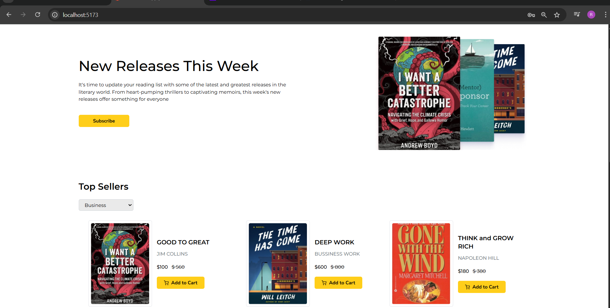

# BookNest: Where Stories Nestle

### Summary
This comprehensive tutorial guides viewers through building a full-stack MERN (MongoDB, Express.js, React.js, Node.js) stack application—specifically, an online bookstore with both frontend and backend development from scratch. The course covers key features including user registration and login (including Google OAuth), product management, shopping cart functionality, checkout process, order management, and an admin dashboard with CRUD operations for books.

The frontend is built using React.js with Tailwind CSS for styling, React Router for navigation, Redux Toolkit with RTK Query for state management and API interaction, and React Hook Form for handling forms efficiently. The backend uses Node.js with Express for API creation, MongoDB with Mongoose for data modeling and database interactions, JWT for authentication tokens, and middleware for route protection.

Users can browse books, filter by category, add books to their cart, register/login, and place orders. Admin users have access to a protected dashboard where they can add, edit, delete, and manage books, as well as view sales and orders. The tutorial also includes deployment instructions for both frontend and backend using Vercel, with environment variables securely managed for API URLs and Firebase credentials.

Firebase Authentication is integrated for user login/registration (email-password and Google OAuth). The admin authentication is managed with a custom MongoDB user model and JWT tokens, with middleware protecting admin routes. The tutorial concludes with deployment and final testing, ensuring the full application is live and functional.

### Highlights
- 🔥 Full-stack MERN app: user-facing bookstore with admin dashboard.
- ⚛️ React.js frontend with Tailwind CSS for responsive UI.
- 🛒 Shopping cart and checkout with Redux Toolkit and RTK Query.
- 🔐 User authentication via Firebase (email/password + Google OAuth).
- 🛠️ Admin panel with CRUD operations, protected by JWT middleware.
- 🗄️ Backend with Express.js, Mongoose schemas, and REST APIs.
- 🚀 Deployment on Vercel with environment variables and secure configs.

### Key Insights
- 🧩 **Comprehensive MERN integration:** The project effectively demonstrates how to integrate React frontend with Node/Express backend and MongoDB using Mongoose. It emphasizes the importance of clear folder structures and separation of concerns, such as keeping frontend and backend code in different folders, and splitting frontend code into components, pages, redux slices, and utils.

- ⚛️ **React Router and state management best practices:** Implementing nested routing with React Router and organizing routes in dedicated files improves code maintainability. Using Redux Toolkit and RTK Query simplifies managing global state and asynchronous API calls, offering a scalable pattern for complex apps.

- 💾 **React Hook Form for form handling:** This library streamlines form validation and data collection without excessive boilerplate, improving developer productivity. Integrating it with authentication forms (login, register) showcases its usefulness for real-world apps.

- 🔒 **Security with JWT and middleware:** The backend protects sensitive routes (admin CRUD APIs) by verifying JWT tokens, preventing unauthorized access. This highlights the importance of securing APIs in production apps, especially admin-only features.

- 🔄 **Smooth UX with loading states and conditional rendering:** The tutorial covers UI states such as loading indicators, error messages, and conditional content rendering based on authentication or API responses, which are crucial for a polished user experience.

- ☁️ **Firebase Authentication integration:** Using Firebase for user auth, including email/password and Google OAuth, simplifies implementing robust login systems with minimal backend code. Context API manages auth state globally, enabling conditional UI rendering for logged-in users.

- 🚀 **Deployment and environment management:** The course includes detailed instructions on deploying frontend and backend separately on Vercel, managing environment variables securely, configuring CORS, and updating API URLs, which are critical steps for real-world app deployment.

### Detailed Summary of Process and Features

**Frontend Setup & Features:**
- Project is initialized with Vite (React template), Tailwind CSS installed and configured for styling.
- React Router is setup with nested routes to handle multiple pages (Home, Book details, Cart, Checkout, Admin dashboard).
- Components are modularized: Navbar, Footer, Banner, BookCard, TopSellers, Recommended, News, Loading, etc.
- Redux Toolkit is configured with slices for cart and API slices using RTK Query for fetching books, orders, etc.
- Shopping cart supports add/remove items, quantity management, subtotal calculation.
- User authentication forms use React Hook Form for validation.
- Firebase Authentication integrated for email/password and Google OAuth login.
- Protected routes implemented to restrict checkout and admin pages to logged-in users.
- Admin dashboard includes product stats, revenue charts (using react-chartjs-2), book management UI with add/edit/delete functionality.
- Responsive and accessible UI with Tailwind utilities and React Icons.

**Backend Setup & Features:**
- Express server with middleware setup for JSON parsing, CORS configured for frontend URL.
- Mongoose schemas/models for Books, Orders, Users (including Admin model with hashed passwords).
- REST API endpoints for CRUD operations on Books, Orders, Admin login with JWT token generation.
- Admin routes protected with middleware verifying JWT token and admin role.
- Firebase Authentication used only on frontend; backend uses custom admin auth.
- Order creation stores user info, products, and order details in MongoDB.
- Aggregation queries to calculate total sales, trending books, and orders for dashboard stats.

**Deployment:**
- Frontend and backend deployed separately on Vercel.
- Environment variables configured for API URLs, Firebase keys, JWT secrets.
- Backend CORS updated to allow Vercel frontend URL.
- Firebase authorized domains updated to include deployed frontend URL.
- Final testing confirms all functionality works in production environment.

---

### Contributors
- 👨‍💼 **Team Lead:** Bukkuru Syam  
- 👨‍💻 **Team Members:**  
  - Battula Saihemanth  
  - Bezawada Bharath Kumar  
  - Bhukya Krishna Kumari
